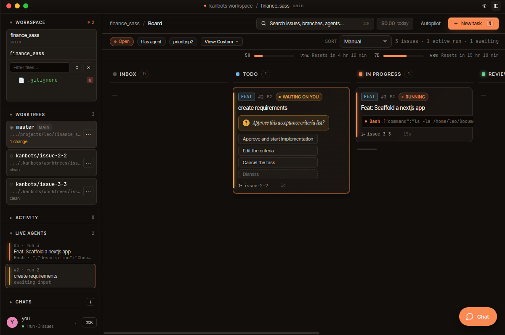

<p align="left">
  
</p>

# kanbots

> **A kanban board that runs 11 agent CLIs in parallel.**
> Claude Code, Codex, Gemini, Cursor, Copilot, Amp, OpenCode, Droid,
> CCR, Qwen, plus any ACP-compatible CLI. Drop a folder. Get a board.
> Dispatch agents on every card — at the same time, each in its own
> worktree. Or hit autopilot and let them split tasks, run them in
> parallel slots, and check their own work while you sleep.



## Highlights

- **Kanban with five columns** (Backlog → Done) plus an Inbox for
  unlabeled cards. Drag to move; in GitHub mode the move is mirrored
  as `status:*` label edits.
- **Local-first issues** by default — stored in SQLite. Switch to
  GitHub mode to drive real issues on a repo.
- **11 agent CLIs supported** — Claude Code, Codex, Gemini, Cursor,
  Copilot, Amp, OpenCode, Droid, CCR, Qwen, plus any ACP-compatible
  CLI. Each run is isolated in a per-run worktree; a pre-push hook
  prevents agents from pushing.
- **Live agent thread** — every `tool_use`/`tool_result` streams in.
  Decision prompts pop into the UI; click an option, the run
  continues.
- **Branch preview** — start the worktree's dev server in one click
  and open a live URL.
- **Promote** — land an agent's worktree as a real commit, or open a
  draft PR (GitHub mode).
- **Sentry import** — auto-pull error groups onto the board for
  triage; one click hands the issue to an agent.
- **MCP server** — `kanbots-mcp-server` exposes the board over Model
  Context Protocol so Cursor, Claude Desktop, or anything MCP-aware
  can drive it.

## Supported agents

Pick the CLI per dispatch from the New Task modal. Each one reuses
its own auth (you don't sign into kanbots — kanbots calls the CLI
that's already on your `PATH`).

| Provider | CLI binary | Sign-in |
| --- | --- | --- |
| Claude Code | `claude` | `claude /login` |
| Codex | `codex` | `codex login` or `OPENAI_API_KEY` |
| Gemini | `gemini` | `gemini auth` |
| Cursor CLI | `cursor-agent` | `cursor-agent login` |
| GitHub Copilot CLI | `gh-copilot` | `gh auth login` (needs Copilot subscription) |
| Amp | `amp` | `amp login` |
| OpenCode | `opencode` | `opencode auth` |
| Droid | `droid` | `droid auth` (Factory account) |
| CCR (Claude Code Router) | `ccr` | reuses Claude Code auth + routes to alternative models |
| Qwen Code | `qwen` | `qwen auth` |
| **Any ACP-compatible CLI** | (your binary) | per CLI — kanbots speaks the Agent Client Protocol over stdio |

Install the ones you want on your `PATH`. You only need at least one.

## Getting started

### Install via npx (recommended)

```sh
npx kanbots
```

That's it. On first run, the right binary downloads automatically (~80MB)
from the [releases page](https://github.com/leodavinci1/kanbots/releases),
and the app opens.

To upgrade later: `npx kanbots@latest`.

macOS arm64/x64 and Linux x64 are fully automated. On Windows, the npx
launcher points you at the `.exe` installer for v1 — see
[`npx-cli/README.md`](npx-cli/README.md).

### Install a packaged build

Latest binaries: [releases page](https://github.com/leodavinci1/kanbots/releases).

**macOS** — builds are currently unsigned, so Gatekeeper rejects the
.dmg on first launch with *"kanbots is damaged and can't be opened"*.
Use the one-line install script — it grabs the right .dmg for your
architecture, clears the quarantine flag, and copies the app into
`/Applications`:

```sh
curl -fsSL https://kanbots.dev/install-mac.sh | bash
```

If you'd rather install by hand: download the .dmg, drag the app
into `/Applications`, then run
`xattr -d com.apple.quarantine /Applications/kanbots.app` once.

**Linux** — `.AppImage` (`chmod +x` and run) or `.tar.xz`.

**Windows** — `.exe` installer. SmartScreen warns on first launch —
*More info → Run anyway*. Like macOS, the build is unsigned.

### Or run from source

```sh
git clone https://github.com/leodavinci1/kanbots.git
cd kanbots
pnpm install
pnpm desktop          # build everything, open Electron
# or, for hot-reload:
pnpm desktop:dev      # Vite + tsup --watch + electronmon
```

You'll need **Node 20+**, **pnpm 10+**, **git**, and at least one of
the supported agent CLIs on your `PATH` (see [Supported
agents](#supported-agents) above — `claude`, `codex`, `gemini`,
`cursor-agent`, etc.). Add `gh` + `gh auth login` if you'll be
driving GitHub issues.

### First run

A workspace picker opens. Pick any folder that contains a git
repository — kanbots creates `.kanbots/` (db + config + worktrees)
inside it and drops you on the board.

Full walkthrough: [docs/getting-started.md](docs/getting-started.md).

## The `.kanbots/` directory

```
.kanbots/
├── db.sqlite        # all issues, threads, runs, providers, settings
├── config.json      # workspace mode + defaults (see docs/configuration.md)
├── worktrees/       # one subdir per agent run
├── attachments/     # files dragged into chats / cards
├── mcp-runtime/     # transient MCP configs handed to claude / codex
└── promote/         # staging area when promoting a worktree to a commit
```

Nothing is written outside this directory or the worktrees it creates.

## Workspace modes

| Mode | Source of issues | Use it for |
| --- | --- | --- |
| `local` | SQLite in `.kanbots/db.sqlite` | Solo work, side projects, anywhere you don't want GitHub Issues |
| `github` | GitHub REST via Octokit | When the repo's issues already live on GitHub |

See [docs/issues.md](docs/issues.md) for auth setup and the
`IssueSource` contract.

## How an agent run works

1. Click **Dispatch** on a card.
2. kanbots creates `.kanbots/worktrees/issue-<n>-<runId>/`, branched
   from the repo's default branch.
3. It spawns `claude -p` (or `codex` exec mode) against that worktree
   with stream-JSON output, parses every event, and forwards it to the
   UI.
4. If the agent requests a decision, the run pauses and a card pops
   up. You answer it; the run continues.
5. When the run finishes (or you stop it), the worktree stays on disk:
   - **Branch preview** — start its dev server.
   - **Promote commit** — land it on your real branch.
   - **Open draft PR** — GitHub mode only.
   - **Discard** — remove worktree + branch.

A pre-push hook is installed in every worktree so agents can't push
to remote on their own. Promotion is always an explicit user step.


*Issue detail: live agent thread, decision prompt with numbered
options, run stats (model, elapsed, tokens, cost), check buttons,
worktree/branch info, and a Reply box that accepts slash commands
(`/spec`, `/review`, `/split`).*

Details: [docs/agents.md](docs/agents.md).

## Autopilot

Autopilot turns dispatch from a one-shot click into a loop.

- **`feature-dev`** — Multi-persona, parallel slots (up to 4). Round-robin
  through your persona roster on the parent issue; agents split into
  subtasks as they go. Stops on completion, stop button, or session
  cost budget.
- **`qa`** — Runs configurable check commands
  (`typecheck` / `tests` / `lint` / `build` / `e2e`), optionally
  starts a dev server and watches it, and dispatches fix runs against
  whatever fails.

Both write to `autopilot_sessions` so you can watch the cycle history,
see every child run, and stop the whole tree from a single button.

Details: [docs/agents.md#autopilot](docs/agents.md#autopilot).

## Documentation

| Topic | What's there |
| --- | --- |
| [Getting started](docs/getting-started.md) | Install, first run, picking a workspace |
| [Agents](docs/agents.md) | All 11 agent CLI runs, decision prompts, containment, costs, autopilot, personas |
| [Providers](docs/providers.md) | AI providers modal — picking the agent CLI, API key storage |
| [Issues](docs/issues.md) | Local mode, GitHub mode, auth, Sentry import |
| [MCP server](docs/mcp-server.md) | Wiring `kanbots-mcp-server` into Cursor or Claude Desktop |
| [Configuration](docs/configuration.md) | `.kanbots/config.json`, env vars, check command overrides |
| [Architecture](docs/architecture.md) | Packages, IPC bridge, database, dependency graph |

## Packages

| Package | Purpose |
| --- | --- |
| [`@kanbots/core`](packages/core) | Domain types, GitHub client, `IssueSource` contract |
| [`@kanbots/local-store`](packages/local-store) | SQLite schema, migrations, repos, `LocalIssueSource` |
| [`@kanbots/dispatcher`](packages/dispatcher) | Agent runtime — spawns the configured agent CLI, parses its stream output, manages worktrees |
| [`@kanbots/llm`](packages/llm) | CLI adapters and provider catalogue |
| [`@kanbots/api`](packages/api) | Pure handler library + agent supervisor (no HTTP server) |
| [`@kanbots/mcp`](packages/mcp) | MCP server (`kanbots-mcp-server` bin) |
| [`@kanbots/web`](packages/web) | React + Vite UI |
| [`@kanbots/desktop`](packages/desktop) | Electron shell, IPC bridge, workspace picker |

## License

MIT — see [LICENSE](LICENSE).
