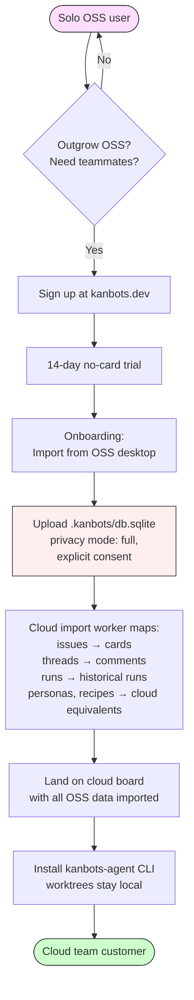

# Why two products?

> **KanBots ships as a free OSS desktop app and a paid Cloud web app.**
> Same UI, same kanban metaphor, same agent runtime. Different audiences,
> different scale of collaboration. This doc explains the split from the
> perspective of an OSS user browsing the repo.

## Summary

KanBots is two products on purpose. The **OSS desktop** (this repo) is
free and MIT-licensed; it runs entirely on your machine and is sustained
by pay-what-you-can [donations](./monetization.md). The **KanBots Cloud**
web app at [kanbots.dev](https://kanbots.dev) is paid and per-seat; it
adds the multi-user features a team needs (real-time presence,
assignment, audit log, cross-device sync, SSO). Neither product is a
"lite version" of the other — they are sized for different audiences.
Both are legitimate paths.

If you are a solo developer, hobbyist, OSS maintainer, or evaluator on
one machine: **OSS desktop is for you and you are not missing
anything**. Every local-productivity feature lives here, with no paywall
and no nag screen. If you are part of a team that needs to share a board
across people: **Cloud is for you**, because the things that make
multi-user work require a server.

---

## The why

The split is forced by economics, not by product strategy.

**Cloud has a backend.** Postgres (Neon), Redis (Upstash), Blob (Vercel),
auth (Clerk), billing (Stripe), realtime SSE infrastructure, agent
supervisor service. Every active user costs money to host — in MAU fees,
in storage, in compute. A free Cloud tier would mean paying for users
who generate no revenue, which the maintainer cannot subsidize. That's
why Cloud is paid-only and why there is no "free trial that becomes a
free tier." Once a 14-day no-card trial ends, the account either
converts to paid or goes read-only.

**OSS desktop has no backend.** It's an Electron app with a SQLite
database and your local git worktrees. There are no servers to fund.
Distribution is GitHub releases. Hosting cost per user is roughly zero.
Sustainability comes from pay-what-you-can donations — not because
donations are reliable revenue, but because the marginal cost of an OSS
user is small enough that gift-economy support is enough.

Together, the two products cover the full market without either side
subsidizing the other. Cloud users pay for the multi-user
infrastructure they actually use; OSS users pay nothing because they
consume nothing of ours beyond a GitHub release download. Donations are
a separate, optional gift relationship that funds OSS-specific overhead
(signing certs, packaging, CI for the OSS repo).

For the long-form donations philosophy, see
[docs/monetization.md](./monetization.md).

---

## What OSS gives you

The OSS desktop is **fully featured for one person on one machine**. No
features are paywalled. No tier unlocks anything. Everything that ships
in this repo, you have:

- **Parallel agent dispatch.** Click Dispatch on as many cards as you
  want; each agent runs in its own git worktree on its own branch. The
  board updates live as runs progress.
- **Autopilot.** Hand kanbots an issue and a budget; it iterates in
  cycles until the work converges or the cost cap hits. Two flavours:
  **feature-dev** (multi-persona round-robin, up to 4 parallel slots)
  and **qa** (typecheck/tests/lint/build/e2e, fix what fails, repeat).
- **Decision prompts.** Agents pause and ask; you click an option, the
  run continues. Supports numbered options, edit-and-resubmit, and
  keyboard shortcuts.
- **Personas.** Plug in product-author, engineer, reviewer, tester
  personas — autopilot round-robins through them. Personas can spawn
  personas as the agent discovers work.
- **Cost analytics.** Per-run, per-card, per-project cost rollups.
  Watch the cost meter accrue live as agents work.
- **Recipe library.** Save common Task Create flows as recipes, share
  them within the workspace.
- **MCP server.** `kanbots-mcp-server` exposes the board over the Model
  Context Protocol, so Cursor, Claude Desktop, or anything MCP-aware
  can drive your boards.
- **Containment.** A pre-push hook is installed in every worktree so
  agents can't push to remote on their own. Promotion is always an
  explicit user step.
- **Sentry import.** Auto-pull error groups onto the board for triage;
  one click hands the issue to an agent.
- **GitHub Issues mode.** Drive real GitHub issues using your personal
  GitHub PAT (no managed app required).
- **Branch preview.** Start the worktree's dev server in one click,
  open a live URL.
- **Promote / draft PR.** Land an agent's worktree as a real commit, or
  open a draft PR (GitHub mode).
- **Both Claude Code and Codex.** Same board, same worktrees, same
  decision UI — KanBots speaks both stream formats behind a single
  `AgentCliAdapter` interface.

If you can do it solo on one machine, OSS does it.

---

## What Cloud adds (team-only features)

The features below **structurally require multi-user**. They cannot work
in OSS not because we held them back, but because OSS has one user, one
machine, no server, no identity surface. They are the features Cloud
exists to provide.

- **Real-time presence on the board.** See who else is looking at the
  card right now. Requires a server to broadcast presence events
  between teammates. OSS has no server.
- **Assignment notifications to teammates.** "Alex, this card is yours"
  needs an identity for Alex. OSS knows only the local git user; there
  are no other users to notify.
- **Audit log for compliance.** A multi-actor mutation history (who
  changed what, when, with what before/after values). OSS has one
  actor — there is nothing to audit between actors.
- **SSO / SCIM (Business+ tier).** Identity federation with the
  customer's Okta / Azure AD / Google Workspace. OSS has no identity
  surface to federate.
- **Cross-device sync of board state.** Move a card on your laptop, see
  it move on your phone. Requires a synced backend. OSS is
  single-machine by design.
- **Org-wide cost analytics.** Roll up agent costs across all
  teammates, all projects, all cards in an organization. OSS is one
  workspace, one user — there is no org to roll up.
- **Slack notifications when a teammate's agent finishes.** Requires
  teammates plus an org-wide Slack integration. OSS has neither.
- **Managed GitHub App.** A centralized GitHub App that simplifies PR
  creation across many users. OSS users wire their own personal GitHub
  PAT or Octokit setup; cloud handles the multi-user PR creation
  story.
- **Real-time collaborative card editing.** Two teammates editing the
  same card description without clobbering each other. Requires
  realtime sync. OSS is single-user.
- **Per-org agent activity dashboard.** Cross-teammate visibility into
  what every agent is doing right now. OSS only shows your own runs
  because there is no one else to show.
- **REST API + PATs (Business+ tier).** A stable HTTP surface for
  scripting against your org's boards. OSS has no HTTP server.
- **Outbound webhooks (Business+ tier).** Fire `card.moved`,
  `run.finished`, etc. to your own listeners. OSS has no event bus to
  subscribe to externally.

Notice the pattern: every Cloud-only feature requires *another person*
or *another device* in the picture. None of them would help a solo user
on one machine.

---

## Feature comparison

| Feature | OSS desktop | KanBots Cloud |
|---|---|---|
| Kanban board with five columns + Inbox | Yes | Yes |
| Parallel agent dispatch | Yes | Yes |
| Autopilot (feature-dev + qa) | Yes | Yes |
| Decision prompts | Yes | Yes |
| Personas | Yes | Yes |
| Cost analytics (per-run, per-card, per-project) | Yes | Yes |
| Recipe library | Yes | Yes |
| MCP server | Yes | Cloud-side MCP post-MVP |
| Sentry import | Yes | Yes |
| GitHub Issues mode | Personal PAT | Managed GitHub App |
| Branch preview | Yes | Yes |
| Promote / draft PR | Yes | Yes |
| Claude Code + Codex | Yes | Yes |
| Containment (pre-push hook) | Yes | Yes |
| Real-time presence | — | Yes |
| Assignment notifications | — | Yes |
| Cross-device sync | — | Yes |
| Audit log | — | Yes |
| SSO / SCIM | — | Business+ |
| Slack notifications | — | Yes |
| Org cost rollup | — | Yes |
| REST API + PATs | — | Business+ |
| Outbound webhooks | — | Business+ |
| Price | Free + donations | Per-seat subscription |
| Storage | Local SQLite | Postgres (Neon) |
| Backend | None | Vercel + Neon + Upstash + Clerk + Stripe |

---

## How to graduate to Cloud

If you start on OSS and later need teammates — you hire a contractor,
get a co-founder, join Y Combinator with a team of three — there is a
clean migration path.

What happens, in plain English:

1. **Sign up at [kanbots.dev](https://kanbots.dev).** Start a free
   14-day trial via Clerk; no card required.
2. **Pick "Import from OSS desktop"** in the onboarding flow (the
   alternative is "Start fresh").
3. **Upload `.kanbots/db.sqlite`.** The file is uploaded over HTTPS to
   Vercel Blob, encrypted at rest. Privacy mode is `full` for this
   one-time operation, with explicit consent.
4. **The cloud import worker maps your data.** SQLite issues → cloud
   cards, threads → comments, runs → historical run records (the agent
   processes themselves are not re-spawned), personas → personas,
   recipes → recipes, config → project settings.
5. **You land on your new cloud board** with all OSS data imported into
   a fresh project named after your OSS workspace.
6. **Install `kanbots-agent`**, run `kanbots-agent login`, daemon claims
   newly assigned cards. Worktrees stay local — only metadata + history
   live in the cloud.
7. **The OSS desktop can keep running** alongside cloud. Many users do
   exactly this: cloud for shared work, OSS for solo experiments.

The `.kanbots/db.sqlite` you uploaded is **not** retained on the cloud
after the import completes — it's deleted from Vercel Blob within 24
hours. The imported data lives in Postgres going forward.

The reverse path (Cloud → OSS) also works: the cloud trial-end page
includes an "Export your data" CTA that produces an NDJSON of cards /
threads / runs which imports cleanly into a fresh OSS workspace via
the OSS app's "Import from cloud export" button.

---

## Anti-cannibalization

A reasonable question: doesn't a free OSS app cannibalize Cloud sales?
The answer is no, because the products serve **structurally different
needs**. We do not artificially gate OSS to drive Cloud upgrades — we
don't have to. Every feature Cloud charges for is a feature that
*requires* multiple users or multiple devices. A solo OSS user on one
machine has nothing to upgrade *to*; the Cloud-only features would not
do anything for them.

The natural separation is: **OSS is what one person does on their
machine; Cloud is what a team does together.** Same kanban metaphor,
same agent runtime, different scale of collaboration, different price.
Buyers self-select on the day they get a teammate. Until that day, the
OSS app does everything they need.

This means the OSS app gets every local-productivity improvement that
lands in cloud, automatically: per cloud build task, an `oss_backport`
field declares whether the change is portable, and portable changes
spawn a sibling task in the OSS task queue. New autopilot personas, new
decision-prompt UX, new MCP tools, new recipe primitives, new cost
analytics — they all land in OSS within ~2 weeks of cloud. The OSS app
is not a stale fork.

---

## See also

- [docs/monetization.md](./monetization.md) — Donations philosophy in
  full: channels, framing, sustainability targets.
- [docs/getting-started.md](./getting-started.md) — Install OSS, first
  run, picking a workspace.
- [docs/architecture.md](./architecture.md) — Packages, IPC bridge,
  database, dependency graph.
- [`brain/00-product/oss-relationship.md`](../../brain/00-product/oss-relationship.md)
  — The canonical, maintainer-perspective version of this story
  (funnel mechanics, donation channel rationale, backport heuristic,
  marketing IA). This OSS-facing doc is the user-perspective summary;
  the brain doc is the source of truth for product framing.
- [kanbots.dev/oss](https://kanbots.dev/oss) — The cloud-side marketing
  page, written for visitors who arrived via the cloud funnel and need
  to learn that OSS is a real, supported alternative.
